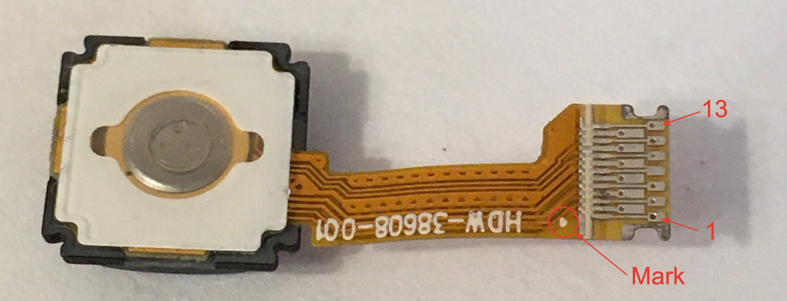

## How to use Blackberry 9900 trackpad
Keywords: avago, adbs, a320, OFN, optical finger navigation.

### 0. Prior work on Blackberry sensors
  * Most comprehensive info on these trackpads I could find is here: https://hackaday.io/project/167075-thumbmouse/log/166999-of-trackballs-and-trackpads
  * Some info is on Arduino forums (I2C variant) https://forum.arduino.cc/t/blackberry-trackpad-connector-20-small-pins-plug-or-ribbon/291406
  * Some info is on Arduino forums (SPI variant) https://forum.arduino.cc/t/blackberry-joystick-navigation-key-hack/61454/13
  * Module which includes I2C trackpad but without connection details https://lectronz.com/products/bb-q20-keyboard-with-trackpad-usb-i2c-pmod

### 1. Pinout (FPC on the left, pads facing you)
The cable is 0.3mm dual-row FPC with notches (used to prevent slipping out of connector).

|Pin |Pin |Function|Wiring note|
|:---|---:|:---    |:---  |
|    | 13 |SHTDWN  |Used for powersave, connect to GND|
| 12 |    |GND     |      |
|    | 11 |i2c SCL |pull-up to VDDIO|
| 10 |    |MOTION_N|Interrupt out, active low|
|    |  9 |i2c SDA |pull-up to VDDIO|
| 8  |    |NRST    |Used on initialization, pull-up to VDDIO|
|    |  7 |GND     |      |
| 6  |    |VDDA, VDDIO, VLED+|+2.6V..3.3V|
|    |  5 |DVDD    |+1.8V |
| 4  |    |Backlight LED -|e.g. 4.7K resistor to MCU open drain output|
|    |  3 |Backlight LED +|e.g. +3.3V|
| 2  |    |Dome switch B||
|    |  1 |Dome switch A||

I could not determine which connector is 100% compatible with this cable (notches are usually somwhere else).
Hirose FH35C-17S seems to be OK here (it didn't arrive yet), just two pins on each side are not connected.

### 2. Voltages
Seems like noone tried to find the datasheet. All circuits with these sensors use 2.8V regulators
which is totally redundant. The chip works fine with 3.3V logic and 3 kOhm pull-ups on I2C pins.

### 3. Wiring WTFs
The chip has an internal +1.8 regulator, but it seems to be disabled here. Or maybe I've killed it somehow.

At one point i mixed the +1.8 and +3.3 power inputs. Surprisingly the sensor almost worked -- it had i2c address `0x33` and registers were available for reading.

The properly functioning sensor has i2c address `0x3B`.

### 4. Interfacing the sensor
Required pins are 5 (+1.8), 6(+3.3), 7, 12, 13(GND), 8 (NRST), 9 and 10 (i2c).

I2c address: `0x3B`  
`Product_ID (reg 0)`: `0x83`

I highly recommend reading the [datasheet](docs/Avago-ADBS-A320-datasheet.pdf) Notes on Power-up section (page 15).
It tells how to enable finger presence detection, configure speed switching, enable i2c burst mode.

Also datasheet describes how to change X/Y orientation in reported data.
